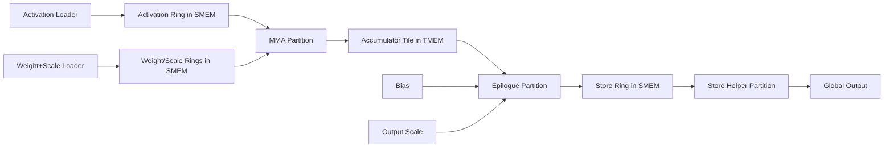
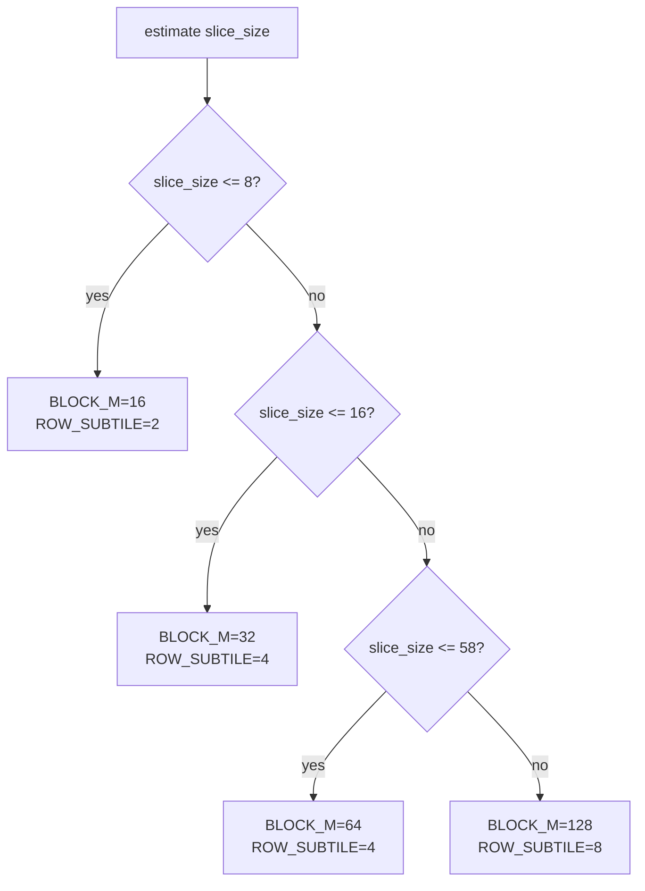
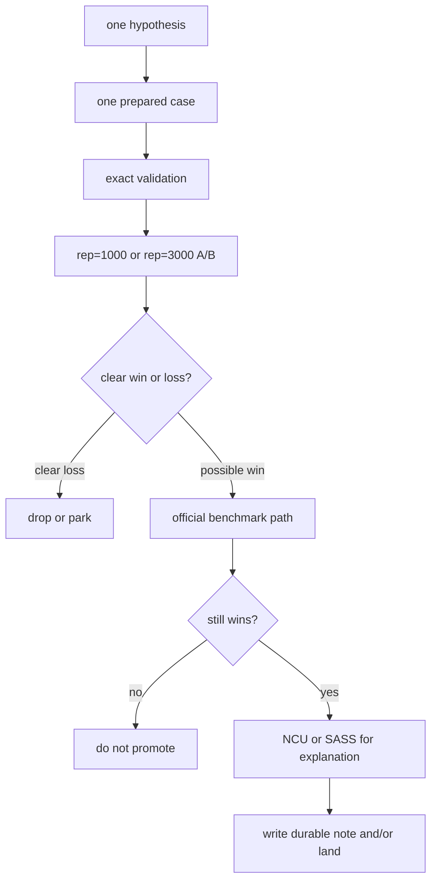

# WS / MoE BMM1 Fused-Gather Matmul Performance Engineering Report

## Document Purpose

This report is a long-form synthesis of the WS / MoE BMM1 fused-gather matmul tuning work captured
in the main initiative and its side artifacts. It is intentionally redundant and tutorial in tone.
The audience is not assumed to already know Triton, Blackwell, Gluon, Nsight Compute, SASS
inspection, or the specific code history in this repo.

The goal is twofold:

1. record what was learned, what was tried, what worked, and what failed
2. make it possible for a future agent with materially less domain knowledge to reproduce the work
   and continue it without starting from scratch

This document is based on:

- the main initiative:
  - [fp8-mxfp4-fused-gather-matmul.md](/root/code/triton-ws-opt/.codex/initiatives/artifacts/fp8-mxfp4-fused-gather-matmul.md)
- specialized durable notes:
  - [ws-epilogue-store-overlap-sass-2026-04-09.md](/root/code/triton-ws-opt/.codex/initiatives/artifacts/ws-epilogue-store-overlap-sass-2026-04-09.md)
  - [ws-low-batch-performance-research.md](/root/code/triton-ws-opt/.codex/initiatives/artifacts/ws-low-batch-performance-research.md)
  - [ws-split-k-design.md](/root/code/triton-ws-opt/.codex/initiatives/artifacts/ws-split-k-design.md)
  - [ws-block-scheduling-research-2026-04-10.md](/root/code/triton-ws-opt/.codex/initiatives/artifacts/ws-block-scheduling-research-2026-04-10.md)
  - [ws-buffer-count-occupancy-exp-2026-04-10.md](/root/code/triton-ws-opt/.codex/initiatives/artifacts/ws-buffer-count-occupancy-exp-2026-04-10.md)
  - [ptx-isa-9.2-blackwell-float2-research.md](/root/code/triton-ws-opt/.codex/initiatives/artifacts/ptx-isa-9.2-blackwell-float2-research.md)

It also reflects the current standalone example implementation:

- [05-moe-bmm1-fused-gather.py](/root/code/triton-ws-opt/python/examples/gluon/05-moe-bmm1-fused-gather.py)

---

## Report Plan

This report is organized as follows:

1. **Executive Summary**
   The short version: what actually mattered, what did not, and what future work should start from.
2. **Problem Statement and Scope**
   What kernel was being tuned, what workloads mattered, and what was explicitly out of scope.
3. **Codebase Map**
   Where the production path lived, where the sandbox lived, and where the final standalone example
   ended up.
4. **Workload Definitions**
   The three major workload families that appeared during the project: KI non-parrot, KI parrot,
   and GPT-OSS 120B MM1.
5. **Current Kernel Architecture**
   How the current example works: partitions, rings, TMEM, helper-store epilogue, low-batch policy.
6. **Chronology of Major Experiments**
   The optimization story in sequence, including which directions produced durable gains.
7. **Measurement Methodology**
   How timing, correctness, and promotion decisions were actually made.
8. **Profiling Methodology**
   How Nsight Compute, PTX, and SASS were used and what each tool was good for.
9. **Detailed Findings by Theme**
   Epilogue, scheduling, occupancy, low batch, loader topology, exactness, and structural tradeoffs.
10. **How To Reproduce the Work**
    Practical step-by-step instructions for a future agent.
11. **Heuristics, Tips, and Failure Modes**
    Rules of thumb that are easy to forget and expensive to rediscover.
12. **Open Problems and Suggested Next Steps**
    What remains plausible and what has been exhausted enough to deprioritize.

Some sections include diagrams in Mermaid format. They are there to make ownership, dataflow, and
experimental methodology easier to reconstruct visually.

---

## 1. Executive Summary

The single most important lesson from this workstream is that the largest wins did **not** come
from broad architectural rewrites. They came from finding the small number of bottlenecks that were
actually dominant on the target workload and attacking those directly.

The main durable conclusions are:

- The epilogue mattered a lot.
  Packed `f32x2` math and packed FP8 output conversion / store were real wins.
- The helper-store epilogue design was the best epilogue structure found for the exact-math path.
  Direct store and async TMA store were both informative, but neither beat the helper path.
- Low-batch performance was mostly a tiling problem, not a split-K problem.
  The production reference already won low batch with `split_k = 1`, which turned out to be the
  correct clue. A low-batch `block_m` ladder plus matching epilogue fragment sizes was enough to
  flip the GPT-OSS MM1 sweep from losing to winning.
- Block scheduling was real but small.
  The best promoted scheduling change was worth about `0.6%` on the target bucket after repeated
  paired measurement. That was worth landing, but it was not a first-order lever.
- Occupancy-by-buffer-deletion was mostly a dead end.
  The kernel wanted its producer-side buffering more than it wanted extra CTA residency.
- A real 2-CTA-per-SM configuration was eventually found for the smallest low-batch regime, but
  even that point was still slightly slower than the live buffered default. So it was an important
  boundary discovery, not a tuning win.
- Merging the two load partitions into one was mostly a structural wash.
  It simplified ownership, but after retuning it landed in roughly the same performance band as the
  split-loader design rather than creating a decisive new win.

The final shape of the project is therefore:

- one standalone example kernel:
  - [05-moe-bmm1-fused-gather.py](/root/code/triton-ws-opt/python/examples/gluon/05-moe-bmm1-fused-gather.py)
- a durable set of side notes explaining why the surviving design looks the way it does
- a strong understanding of which directions are likely worth continuing and which are already
  close to exhausted

The single best “future-agent” lesson is this:

> do not start by changing everything at once. isolate one hypothesis, force the comparison onto the
> same prepared inputs and same GPU, and only promote changes that survive both correctness and
> repeated long-run timing.

---

## 2. Problem Statement and Scope

The original problem was to improve performance for a fused-gather MoE BMM1-style matmul on
Blackwell / GB300 for:

- fp8 activations
- mxfp4 weights
- per-expert bias
- fused SwiGLU
- ragged gather / expert routing
- fp8 output

There were two related but distinct code paths during the project:

1. the **production-style reference path** under `triton_kernels`
2. a **sandbox / example path** used for more aggressive iteration

The project eventually converged on the standalone example path as the canonical home of the tuned
kernel. That was an intentional cleanup decision: keep the tuned kernel in a single readable
example, preserve the measurements and lessons in durable docs, and avoid keeping multiple half-live
perf kernels checked into `python/perf`.

What was in scope:

- Blackwell-only tuning
- persistent kernels
- fused gather
- exact or reference-compatible correctness
- epilogue tuning
- low-batch and large-batch sweeps
- structural changes inside the example kernel
- benchmarking, profiling, PTX/SASS inspection, and scheduling experiments

What was not in scope:

- changing public production APIs casually
- supporting every hardware family equally
- broad compiler changes as the first line of attack
- treating split-K as mandatory before the low-batch tile problem was understood
- preserving every experimental kernel in the live tree once its lesson had been captured

---

## 2.5 Prerequisites and Baseline Environment

Before trying to reproduce any result in this report, establish the same baseline assumptions the
project used.

### Hardware / Platform Assumptions

- GPU family: Blackwell / GB300-class
- CUDA target: Blackwell class (`sm_100` / `sm_103a` showed up during PTX / ptxas work)
- Triton backend: CUDA
- Timing and profiling were usually done on one GPU at a time even though the machine had four GPUs
- Many small scheduling and low-batch comparisons were intentionally pinned to one GPU to reduce
  cross-device noise

### Repo / Branch Assumptions

- repo root used for build/test instructions:
  - `/root/code/triton`
- active worktree used for this initiative:
  - `/root/code/triton-ws-opt`
- branch:
  - `jeffniu/kernels`
- remote:
  - `jeffniu-openai/jeffniu/kernels`

### Build / Import Assumptions

The practical local-import command pattern throughout this project was:

```bash
cd /root/code/triton-ws-opt
PYTHONPATH=python/triton_kernels:python \
python python/examples/gluon/05-moe-bmm1-fused-gather.py
```

For test work, the common pattern was:

```bash
cd /root/code/triton
make
cd /root/code/triton-ws-opt
PYTHONPATH=python/triton_kernels:python pytest -s --tb=short \
  python/examples/gluon/05-moe-bmm1-fused-gather.py::test_op
```

Important practical note:

- this workstream did **not** depend on an external dataset or external routing dump
- the example generates routing, logits, scales, and weights locally in `prepare_case(...)` and
  `init_routing_data(...)`

That means a future agent can reproduce most of the work from the repo checkout alone.

When working in a copied private workspace rather than the canonical repo checkout, use the same
pattern but keep everything workspace-local:

```bash
cd /path/to/private/workspace
PYTHONPATH=python/triton_kernels:python python python/examples/gluon/05-moe-bmm1-fused-gather.py
```

If this exact `PYTHONPATH` is not set, the copied-workspace experiments can fail with import errors
even though the code is present locally.

The prompt-optimization loop exposed a second failure mode for copied workspaces: the repo snapshot
can be logically correct while still being physically incomplete for runtime use. In this project,
isolated workspaces copied from the active worktree were initially missing runtime source files
needed by Triton itself, which caused:

- `ModuleNotFoundError` on `triton.language.extra.cuda.libdevice`
- `0 active drivers ([])` because the copied `triton.backends` tree exposed no Nvidia backend

For an isolated workspace that is expected to run Triton examples locally, verify at minimum:

1. `python/triton/language/extra/cuda/libdevice.py` is present
2. `python/triton/backends/nvidia/` is present
3. `PYTHONPATH=python/triton_kernels:python` resolves `triton` from the workspace copy
4. `from triton.runtime import driver; driver.active` succeeds

If any of those fail, fix the workspace recipe first. Do **not** treat the worker as blocked on the
kernel until the sandbox can import Triton and create a CUDA driver.

There was also a separate local-machine trap: an untracked directory
`third_party/nvidia/language/cuda/libdevice/` shadowed the tracked module
`third_party/nvidia/language/cuda/libdevice.py`. When that shadow package existed, Python imported
the package first and `libdevice.exp` disappeared during JIT dependency resolution. Removing the
shadow package restored the correct module import.

One more subtlety matters here: in the canonical Triton tree, some of these runtime paths are
symlinks rather than ordinary directories. In particular:

- `python/triton/backends/nvidia -> third_party/nvidia/backend`
- `python/triton/language/extra/cuda -> third_party/nvidia/language/cuda`

So a naive private-workspace copy can look fine while still being broken in one of two ways:

- the symlink target points back outside the private workspace
- the copy loses the target contents and keeps only an incomplete shadow

For isolated-agent work, the safer workspace recipe is:

- copy the repo snapshot
- then explicitly dereference or overlay those Triton runtime symlink targets into the workspace

Do not assume `rsync -a` or a simple file copy is sufficient.

The durable fix added for this loop is:

- [ws-report-promptopt-make-workspace.py](/root/code/triton-ws-opt/.codex/initiatives/artifacts/ws-report-promptopt-make-workspace.py)

That helper:

- copies the current worktree snapshot
- omits all other initiative artifacts except this report
- overlays the active Triton runtime's `backends` and `language/extra/cuda` trees with symlinks
  dereferenced
- deletes the shadow `cuda/libdevice/` package directory if it appears in the workspace

### Environment Checklist

Use this as a “do not start until this is true” checklist:

- current device is Blackwell-capable
- local Triton build imports from this checkout
- `make` succeeds in `/root/code/triton`
- the example test passes
- the example benchmark script runs end-to-end
- Nsight Compute is available
- `nvdisasm` is available

### Canonical Reproduction Commands

| Goal | Command | Success Signal |
|---|---|---|
| Build local Triton | `cd /root/code/triton && make` | build completes |
| Syntax-check example | `python -m py_compile python/examples/gluon/05-moe-bmm1-fused-gather.py` | no output |
| Validate example | `PYTHONPATH=python/triton_kernels pytest -s --tb=short python/examples/gluon/05-moe-bmm1-fused-gather.py::test_op` | pytest passes |
| Run official perf sweep | `PYTHONPATH=python/triton_kernels python python/examples/gluon/05-moe-bmm1-fused-gather.py` | prints benchmark data and writes report files |
| Run focused same-case timing | use `prepare_case(...)` + `do_bench_cudagraph(...)` in a one-off Python driver | reproducible same-GPU timing |

---

## 3. Codebase Map

The work touched several layers, but they played different roles.

### 3.1 Production Reference Path

The production-side entrypoint was:

- [matmul.py](/root/code/triton-ws-opt/python/triton_kernels/triton_kernels/matmul.py)

Important production-side implementation files included:

- [\_p_matmul.py](/root/code/triton-ws-opt/python/triton_kernels/triton_kernels/matmul_details/_p_matmul.py)
- [\_matmul.py](/root/code/triton-ws-opt/python/triton_kernels/triton_kernels/matmul_details/_matmul.py)
- [opt_flags.py](/root/code/triton-ws-opt/python/triton_kernels/triton_kernels/matmul_details/opt_flags.py)
- [opt_flags_nvidia.py](/root/code/triton-ws-opt/python/triton_kernels/triton_kernels/matmul_details/opt_flags_details/opt_flags_nvidia.py)

These were useful for:

- understanding legality
- understanding existing heuristics
- comparing against the production reference
- reusing conceptual ideas

They were **not** the best place for rapid experimentation. The sandbox/example route was much
faster to iterate on.

### 3.2 Canonical Tuned Kernel

The final home of the tuned kernel is:

- [05-moe-bmm1-fused-gather.py](/root/code/triton-ws-opt/python/examples/gluon/05-moe-bmm1-fused-gather.py)

This file eventually became:

- the kernel
- the test
- the benchmark sweep
- the durable example

That structure was deliberately aligned with the style of:

- [01-attention-forward.py](/root/code/triton-ws-opt/python/examples/gluon/01-attention-forward.py)

### 3.3 Durable Notes and Side Artifacts

The main initiative and specialized artifacts under:

- [/root/code/triton-ws-opt/.codex/initiatives/artifacts](/root/code/triton-ws-opt/.codex/initiatives/artifacts)

became the source of truth for:

- why certain code was kept
- why other code was deleted
- which experimental branches were dead ends
- exact benchmark/profiling evidence

This turned out to matter a lot. Many experiments were correct and interesting but not promotable.
Without durable notes, those branches would have looked like random churn instead of accumulated
knowledge.

---

## 4. Workload Definitions

Three workload families mattered at different times.

### 4.1 KI Non-Parrot Large Family

This was the original major target family from the user’s workload reproduction:

- `K = 5120`
- `N = 10240`
- large batch sweep
- `n_expts_act = 4`
- multiple expert-count / shard-count variants

This family was the main driver for the early `ws` vs `gluon` vs `gluon_optimized` work and for
the epilogue optimization work.

It also remained the explicit prioritization default in the initiative whenever time was limited.
A future agent should preserve that bias unless the user redirects it:

- if forced to choose, prioritize the large non-parrot family first
- treat the parrot-gather family as a secondary regression or follow-up target

### 4.2 KI Parrot-Gather Small Family

This was smaller and secondary:

- `K = 1280`
- `N = 2560`
- small batch sweep

It mattered as a correctness and nearby-regression check, but it was not the main tuning anchor.

### 4.3 GPT-OSS 120B MM1

This became the most important later sweep because it gave a concrete low-batch target that
reflected the standalone example’s intended use.

The derived geometry was:

- `num_experts = 128`
- `experts_per_token = 4`
- `hidden_size = 2880`
- `intermediate_size = 2880`
- MM1 pre-activation shape: `2880 x 5760`

One of the most important strategic lessons came from this workload:

> the low-batch gap to the production reference did not imply that split-K was the next missing
> optimization.

The reference already won low batch with `split_k = 1`. That made it much more likely that the
example’s low-batch loss was a tile-shape / staging problem than a decomposition problem, and that
turned out to be correct.

### 4.4 End-State Performance Snapshot

By the end of this workstream, the current example was ahead of the production reference across the
entire checked GPT-OSS 120B MM1 batch sweep recorded in:

- [ws-current-batch-sweep-vs-reference-2026-04-10.csv](/root/code/triton-ws-opt/.codex/initiatives/artifacts/ws-current-batch-sweep-vs-reference-2026-04-10.csv)

Summary statistics from that sweep:

- number of sweep points: `48`
- mean speedup over reference: `+5.55%`
- median speedup over reference: `+4.56%`
- best point: `batch=13312`, about `+9.93%`
- weakest point: `batch=27648`, about `+1.80%`

Representative points:

| Batch | Example ms | Reference ms | Speedup |
|---:|---:|---:|---:|
| 128 | 0.03290 | 0.03393 | +3.14% |
| 256 | 0.03310 | 0.03406 | +2.89% |
| 512 | 0.03396 | 0.03568 | +5.06% |
| 1024 | 0.03587 | 0.03722 | +3.76% |
| 2048 | 0.04033 | 0.04333 | +7.45% |
| 8192 | 0.06971 | 0.07610 | +9.16% |
| 16384 | 0.10992 | 0.11804 | +7.39% |
| 31744 | 0.18032 | 0.19349 | +7.30% |

That matters for interpreting the rest of the report. The report is not describing an unfinished
spike that never beat the reference. It is describing how the current standalone example reached a
state where it consistently outperformed the production reference on the measured GPT-OSS sweep.

---

## 5. Current Kernel Architecture

The current standalone example is a persistent fused-gather grouped GEMM with explicit warp
specialization.

At a high level, it has:

- an activation loader partition
- a weight + weight-scale loader partition
- an MMA partition
- an exact helper-wavefront epilogue partition
- a helper store partition

### 5.1 Dataflow Diagram



### 5.2 Why the Helper Store Exists

The helper store partition is easy to misunderstand. It is not just “another way to store.” It is
an ownership transfer.

Without a helper:

- the epilogue warps compute the fragment
- the epilogue warps own address generation
- the epilogue warps issue the final global stores

With a helper:

- the epilogue warps compute the fragment
- the fragment is written into an SMEM ring
- helper warps load it into their own registers
- helper warps issue the final global stores

That distinction ended up being critical. The helper path was not only about buffering. It was
about moving final-store issue bandwidth onto different warps.

### 5.3 The Current Low-Batch Policy

The final live example uses a `slice_size`-based low-batch selector:

- `slice_size <= 8`:
  - `block_m = 16`
  - `epilogue_row_subtile_factor = 2`
- `slice_size <= 16`:
  - `block_m = 32`
  - `epilogue_row_subtile_factor = 4`
- `slice_size <= 58`:
  - `block_m = 64`
  - `epilogue_row_subtile_factor = 4`
- else:
  - `block_m = 128`
  - `epilogue_row_subtile_factor = 8`

This selector was one of the most important landed changes in the whole project.

### 5.4 Control-Flow Diagram For the Low-Batch Ladder



### 5.5 Why `block_m = 16` Needed an Epilogue Change

The exact helper-wavefront epilogue originally did not compile at `block_m = 16` with the old
fragment shape. This could easily have led to the wrong conclusion:

> “small `block_m` requires a major epilogue rewrite”

That conclusion would have been wrong.

What was actually true:

- the old row-subtile factor made the packed split path illegal
- reducing the row-subtile factor fixed the legality issue
- the rest of the exact helper-store epilogue could remain the same

This kind of distinction mattered repeatedly in this project:

- some failures were architectural
- some failures were just layout or legality mismatches

The job was to tell them apart before overreacting.

---

## 6. Chronology of Major Experiments

This section is deliberately opinionated. It does not try to list every micro-experiment. It lists
the experiments that changed understanding.

### 6.1 Baseline Reproduction and Comparison Harness

Early work focused on:

- reproducing the target KI workload locally
- building a benchmark harness that exercised the same prepared inputs across kernels
- adding correctness checks that were cheap enough to use continuously

This phase mattered more than it looked like at the time. It created the experimental substrate
that made later iterations fast and trustworthy.

Important outputs from this phase:

- reproducible batch sweeps
- side-by-side kernel comparison
- exact host-side validation mode

### 6.2 Packed `f32x2` Epilogue Math and Packed FP8 Stores

This was the first major epilogue breakthrough.

The central idea was:

- keep more of the epilogue in packed two-lane form
- avoid scalarizing the output path more than necessary
- make the final FP8 conversion and store path stay packed

This was one of the rare changes that clearly moved the target bucket.

Why it worked:

- fewer instructions
- less scalar unpack/repack churn
- better match to Blackwell packed-lane capabilities

Why it mattered strategically:

- it demonstrated that the epilogue was not “just cleanup”
- it justified much deeper epilogue investigation afterward

### 6.3 Helper-Store Epilogue

The helper-store path became the best exact-math design found for the example.

Several competing ideas were evaluated:

- direct `gl.store`
- async TMA store issued by the epilogue itself
- separate-partition TMA store consumer
- helper-store consumer using ordinary global stores

The helper path won because it combined:

- a simple ownership transfer
- strong overlap behavior
- good final-store code generation
- no need to wait for global completion before freeing the ring slot

### 6.4 Exact vs Approximate SwiGLU

One subtle but important lesson was that “exact” had to be defined carefully.

The original production-style reference path was not an exact oracle for SwiGLU because it used an
approximate exponential path. So an “exact” validation mode had to be introduced using host-side
exact components.

This led to two separate ideas that had to be kept distinct:

- **exactness relative to the underlying math**
- **bitwise identity to another kernel**

The exact-math path could be very close to `gluon_optimized` without being bitwise identical.

### 6.5 Direct Store and Async TMA Store

These experiments were valuable even though they did not win.

They taught three important lessons:

1. direct store can be made competitive, but it still trails the helper path
2. async TMA store does not automatically win just because it sounds more “advanced”
3. ownership and synchronization structure matter more than the superficial store primitive

One especially important sub-result:

- a separate-partition TMA-store consumer needed `fence_async_shared()` before `arrive(ready)`
  for exactness

That is the kind of finding that is easy to lose if it only lives in chat.

### 6.6 Block Scheduling

The scheduling work was a good example of how to do a bounded research pass correctly.

What happened:

- a broad strategy inventory was assembled
- the live schedule hook was widened temporarily
- many candidate schedules were swept
- the best candidate was promoted only after repeated paired long-run analysis

Result:

- scheduling mattered
- but only modestly
- the promoted change was worth about `0.6%`, not a dramatic rearchitecture
- the one schedule that actually survived was `band_n_20_row_major`

This is the kind of area where many tuning efforts waste time: the knob is real, but not first
order.

More concretely, the broad schedule sweep and the repeated same-GPU paired reruns showed that the
only schedule worth promoting was the banded row-major traversal captured in:

- [ws-block-scheduling-research-2026-04-10.md](/root/code/triton-ws-opt/.codex/initiatives/artifacts/ws-block-scheduling-research-2026-04-10.md)

The key paired result was:

- old full-width `row_major`: about `0.34270 ms`
- `band_n_20_row_major`: about `0.34061 ms`

After promotion, the live repo was intentionally cleaned back down to only that schedule. The
broader multi-strategy switch and sweep harness were removed from the live code and left only in the
durable artifacts. A future agent should therefore treat `band_n_20_row_major` as the scheduling
baseline, not as a temporary experiment.

### 6.7 Low-Batch GPT-OSS Work

This was arguably the most important late-phase insight.

At first glance, low-batch underperformance might have suggested:

- split-K
- more occupancy
- more radical decomposition changes

But the reference already won low batch with `split_k = 1`. Once that clue was taken seriously, the
correct next question became:

> “is the example simply using the wrong `block_m` at low batch?”

The answer was yes.

This led to:

- a corrected `block_m` ablation
- the low-batch ladder
- the realization that `block_m = 16` was legal with a smaller row-subtile factor

This single line of work eventually flipped the entire GPT-OSS sweep from losing to winning.

### 6.8 Occupancy / Buffer Reduction

This was a good example of a dead end that still taught something important.

The naive story was:

- lower load buffers
- get below half-SMEM and half-TMEM
- double the persistent CTA count
- enjoy more concurrency

Reality was more complicated:

- first, the doubled-grid candidates did not actually reach 2 CTAs/SM
- later, a combination of reduced buffers and forced `maxnreg` did reach near-2 CTA residency in
  the smallest regime
- even then, the kernel was still slightly slower than the buffered default

Lesson:

> occupancy is not a goal by itself. It is only valuable when the extra concurrency pays back the
> structural cost required to get it.

### 6.9 Loader Topology: One Loader vs Two

The single merged load partition looked attractive because `gluon_optimized` used one loader.

What actually happened:

- naive merge regressed
- retuned merge recovered to the same band
- restoring split loaders later also stayed in the same band

So the real lesson was:

> producer ownership is important, but the difference between one loader and two loaders was not a
> decisive performance lever in the final example once the rest of the kernel was tuned.

This was mostly a cleanliness / structural choice, not a big win source.

---

## 7. Measurement Methodology

This section is one of the most important in the whole report. A future agent can easily reproduce
the code changes if the methodology is clear. Reproducing the *correct conclusions* is harder.

### 7.1 Separate “Benchmark Harness” From “Prepared-Case A/B”

Two kinds of measurements were used:

1. **official benchmark harness**
   - the promoted decision path
   - the thing that should decide whether a change is actually good
2. **same prepared-case A/B**
   - used for tight local comparisons
   - useful for isolating one variable
   - not always enough by itself to promote a change

This distinction mattered. In more than one case, a change looked good in a same-prepared-case
control but did not hold up in the official benchmark path.

If a future agent learns only one measurement lesson from this report, it should be this one.

### 7.2 Use Long Repetitions For Small Deltas

Small deltas were never trusted on `rep=100`.

For sensitive comparisons, the project used:

- `rep=1000`
- or `rep=3000`

and often:

- same GPU
- same prepared inputs
- alternating execution order

This is what turned the scheduling promotion from “maybe real” into “statistically credible.”

### 7.3 Cudagraph Timing Changes the Shape of the Curve

The benchmark shifted to `do_bench_cudagraph`, and that was not a cosmetic change.

It changed the measured curve materially at small and medium batch sizes by removing host-launch
overhead. That meant:

- some prior timing assumptions had to be updated
- some “small batch improvements” were really launch-overhead stories, not device stories

If the workload is device-side tuning, cudagraph timing is often the more relevant baseline.

### 7.4 Validate Correctness Continuously

The tuning loop used correctness checks frequently, not only at the end.

Two important correctness lessons:

- the production-style “original” path was not an exact SwiGLU oracle
- exact host-side validation needed to be part of the benchmarking workflow

Practical guidance:

- use quick validation during inner-loop iteration
- use exact validation before promotion
- keep the validation setup as close as possible to the benchmark setup

### 7.5 Promotion Criteria Were Relative, Not Absolute

A change was promotable if it:

- held up against the current baseline on the same target bucket
- kept correctness
- survived longer-run timing
- did not obviously regress nearby important shapes

This sounds obvious, but it prevented a lot of churn. Many experiments produced an interesting
number once. Much fewer produced a durable reason to keep extra code in the kernel.

### 7.6 The Actual Measurement Ladder Used In Practice

The most reliable measurement workflow ended up being:



This ordering was intentional:

- correctness before timing
- timing before heavy profiling
- official-path validation before promotion

### 7.7 Concrete Examples of “Official Path” vs “Prepared-Case A/B”

#### Official example benchmark path

```bash
cd /root/code/triton-ws-opt
PYTHONPATH=python/triton_kernels \
python python/examples/gluon/05-moe-bmm1-fused-gather.py
```

This runs the `triton.testing.perf_report` sweep defined in the example and is the most stable
benchmark-facing route for the current kernel.

#### Prepared-case A/B pattern

```python
prepared = prepare_case(batch_size=128, device="cuda:0", seed=0)
ref_y, _ = run_provider(prepared, "reference")
cand_y, _ = run_provider(prepared, "example")
torch.testing.assert_close(cand_y.float(), ref_y.float(), atol=..., rtol=0)
ms = do_bench_cudagraph(lambda: run_provider(prepared, "example")[0], rep=3000)
```

That is not the literal helper used in the repo, but it is the exact style of one-off driver that
produced most of the tight A/B control measurements in the project.

### 7.8 When A “Win” Was Not Trusted

A measured improvement was treated as not yet trustworthy if any of the following were true:

- it appeared only in one short run
- it was below about `1%` and had not been rerun with longer reps
- it only showed up in a prepared-case control and not in the official benchmark path
- it relied on a correctness gate that was looser than the current exact-reference standard
- it depended on code that made the live example materially harder to understand without a durable
  advantage

This standard explains why some technically interesting paths were eventually removed from the live
code even though they “worked.”

---

## 8. Profiling and Inspection Methodology

The project used four complementary views:

1. timing
2. NCU metrics
3. PTX / compiled metadata
4. SASS

Each answered different questions.

### 8.1 Timing Answers “Is It Faster?”

Timing was the final arbiter. NCU can explain a win or a loss, but it does not replace timing.

### 8.2 NCU Answers “Why Might It Be Faster or Slower?”

The project repeatedly used NCU to inspect:

- tensor utilization
- SM throughput
- DRAM throughput
- L2 throughput
- issue activity
- eligible warps
- `long_scoreboard`
- `mio_throttle`
- barrier stall
- launch occupancy limits
- shared memory per block
- registers per thread
- CTA concurrency

Typical patterns:

- high `long_scoreboard` often indicated memory latency / dependency problems
- high `mio_throttle` often indicated memory issue pressure
- low eligible warps often signaled structural starvation rather than raw occupancy alone
- occupancy sections were critical when testing “2 CTA” hypotheses

### 8.3 PTX and Compiled Metadata Answer “What Did Triton / ptxas Decide To Generate?”

Two especially useful tricks:

1. `warmup()` plus `_init_handles()`
   - good for resource metadata
   - useful for seeing `n_regs`, spills, shared memory, TMEM
2. inspecting generated PTX
   - good for confirming that a conceptual optimization actually lowered to the intended packed
     instruction family

For example, the packed epilogue work was validated not only by timing but by confirming PTX
contained things like:

- packed `f32x2` arithmetic
- packed FP8 conversion
- packed stores

### 8.4 SASS Answers “How Are The Instructions Actually Issued?”

SASS inspection became especially important for the epilogue work.

It answered questions like:

- is ptxas already interleaving SMEM stores with arithmetic?
- did moving `arrive(empty)` actually move in the final code?
- does the helper consumer really look like a wait/load/store loop?

This was how the project got from vague beliefs about overlap to concrete statements.

### 8.5 How To Read NCU Occupancy Counters Correctly

The occupancy experiments repeatedly demonstrated that it is easy to think you have increased
concurrency when you have only increased launch waves.

The counters that mattered most were:

| Counter | What it answered | How it was used |
|---|---|---|
| `sm__ctas_active.avg.per_cycle_active` | how many CTAs were actually resident per SM on average | the real concurrency gate |
| `sm__warps_active.avg.per_cycle_active` | how many warps were active per SM on average | supporting evidence for higher residency |
| `launch__occupancy_limit_registers` | how many blocks registers allow | used to rule out false “should fit” assumptions |
| `launch__occupancy_limit_shared_mem` | how many blocks shared memory allows | same |
| `launch__registers_per_thread` | actual compiled register count | critical when testing `maxnreg` or structural changes |
| `launch__shared_mem_per_block` | effective per-block SMEM | more trustworthy than hand-estimated dynamic SMEM alone |

The key lesson is:

> `Waves Per SM` is not the same thing as CTA concurrency.

In one important failed experiment, the launch grid doubled and waves per SM increased, but
`sm__ctas_active.avg.per_cycle_active` remained `1.00`, so the hardware never actually admitted a
second resident CTA.

### 8.6 How To Read SASS For This Project

For this kernel family, the most important SASS mnemonics and patterns were:

| Pattern | Why it mattered |
|---|---|
| `STS.*` | shared-memory payload writes, especially to the helper ring |
| `STG.E` | final global stores in the helper-store path |
| `SYNCS.ARRIVE` | barrier arrival placement, especially early/late slot release |
| `TRYWAIT` / wait sequences | ring-slot consumption / availability behavior |
| `DEPBAR.LE` | dependency barrier behavior in async-store style paths |
| `UTMASTG.*` / `UTMACMDFLUSH` | async TMA store issue path |
| `setmaxnreg.*` | ptxas / warp-specialization register-pool behavior |
| packed arithmetic / conversion instructions | proof that the float2 / packed-output idea actually lowered |

When reading SASS in this project, the most useful questions were:

1. are the store-side instructions clustered or interleaved?
2. did a source-level barrier move actually survive lowering?
3. does the helper consumer really look like a wait/load/store pipeline?
4. did the intended packed arithmetic lower to packed machine instructions?

### 8.7 Worked Example: Proving the Early `arrive(empty)` Change Was Real

The helper-consumer early-release tweak is a good template for SASS-driven reasoning.

The workflow was:

1. make a small source change:
   - move `arrive(empty)` earlier in the helper consumer
2. compile the kernel into an isolated Triton cache
3. dump the cubin with line info
4. inspect the source-mapped SASS window
5. confirm that `SYNCS.ARRIVE` moved ahead of the `STG.E` cluster
6. rerun long timing on the same GPU

This is a stronger form of evidence than:

- “the source looks better”
- or “the timing moved slightly”

because it proves both:

- the compiler kept the semantic change in the final schedule
- and the schedule change had measurable impact

### 8.8 Worked Example: Proving a 2-CTA Hypothesis False

Another reusable pattern came from the occupancy experiments.

The first version of the hypothesis was:

- lower buffers
- go under half-SMEM and half-TMEM
- double `NUM_SMS`
- get 2 CTAs per SM

What disproved the first version was not timing alone. It was:

1. NCU showing `sm__ctas_active.avg.per_cycle_active = 1.00`
2. NCU showing `launch__occupancy_limit_registers = 1`
3. NCU showing `launch__occupancy_limit_shared_mem = 1`
4. NCU showing effective SMEM still above half once driver SMEM was counted

Only after that did it become clear that the “2x CTA” run was not testing a real 2-CTA condition at
all.

### 8.9 Worked Example: Proving a 2-CTA Hypothesis True But Still Unhelpful

The follow-up version of the same story is equally important.

Later, a combination of:

- smaller buffers
- doubled persistent grid
- forced `maxnreg`

did produce:

- `launch__occupancy_limit_registers = 2`
- `launch__occupancy_limit_shared_mem = 2`
- `sm__ctas_active.avg.per_cycle_active ~= 1.85`

That proved the kernel really was near-2 CTA resident.

And yet the runtime was still slightly worse than the live buffered default.

This is one of the most valuable profiling lessons in the report:

> even a correctly proven hardware effect can still be the wrong optimization.

---

## 9. Practical Tool Recipes

This section is intended to be copy-pasteable.

### 9.1 Benchmark a Single Case

Use the example’s benchmark surface directly when available, or the old perf harness when a
historical comparison is needed.

Example pattern:

```bash
PYTHONPATH=python/triton_kernels python \
  python/examples/gluon/05-moe-bmm1-fused-gather.py
```

For targeted ad hoc comparison inside Python, use the same prepared case and `do_bench_cudagraph`.

### 9.2 Exact Validation

Use the exact validation path rather than assuming the approximate reference is an oracle.

In practice during this project, the most reliable path was:

- prepare one case
- run reference and candidate on identical prepared inputs
- compare decoded float32 outputs

### 9.3 Compile a Triton Kernel and Read Resource Usage

Useful pattern:

```python
kernel = ws_matmul_kernel.warmup(...)
kernel._init_handles()
print(kernel.metadata.shared)
print(kernel.metadata.tmem_size)
print(kernel.n_regs)
print(kernel.n_spills)
```

Why this matters:

- it is faster than fully benchmarking every candidate
- it lets you reject impossible or irrelevant candidates early
- it was essential for the occupancy experiments

### 9.4 Isolate Triton Cache Output

To study a single variant’s generated cubin / PTX:

```bash
CUDA_VISIBLE_DEVICES=0 \
TRITON_CACHE_DIR=/tmp/ws_cache_example \
PYTHONPATH=python/triton_kernels \
python -m python.perf.bench_matmul_parrot_gather ...
```

Then:

```bash
find /tmp/ws_cache_example -name '*.cubin'
```

This avoids confusion with stale or mixed cache entries.

### 9.5 Dump SASS With Source Lines

```bash
nvdisasm --print-line-info /tmp/<kernel>.cubin > /tmp/<kernel>.sass
```

This was the core method for the epilogue overlap note.

### 9.6 Collect NCU

For a focused kernel profile:

```bash
CUDA_VISIBLE_DEVICES=0 \
ncu -f -o /tmp/profile_name --set full \
  python <driver>.py
```

For a targeted metric check:

```bash
ncu -f -o /tmp/profile_name \
  --metrics sm__ctas_active.avg.per_cycle_active,sm__warps_active.avg.per_cycle_active,\
launch__registers_per_thread,launch__shared_mem_per_block,\
launch__occupancy_limit_registers,launch__occupancy_limit_shared_mem \
  python <driver>.py
```

To extract the results later:

```bash
ncu --import /tmp/profile_name.ncu-rep --csv --page raw --metrics \
sm__ctas_active.avg.per_cycle_active,sm__warps_active.avg.per_cycle_active,\
launch__registers_per_thread,launch__shared_mem_per_block,\
launch__occupancy_limit_registers,launch__occupancy_limit_shared_mem
```

This exact import flow was used to prove that one “2x CTA” experiment was not actually getting two
resident CTAs, and later to prove that a forced-register-cap configuration really did get there.

### 9.7 Use SASS and NCU Together

A recurring pattern in the project was:

1. timing says something changed
2. NCU says which broad counters moved
3. SASS explains whether the intended instruction ordering / ownership change actually occurred

Do not use only one of these if the question is subtle.

### 9.8 A Better “Question To Tool” Mapping

When in doubt, use this lookup:

| You want to know... | Start with | Escalate to |
|---|---|---|
| did my change lower resources? | `warmup()` metadata | NCU launch stats |
| did my change actually create more residency? | NCU targeted occupancy metrics | full NCU occupancy section |
| did my packed path lower to packed ops? | PTX | SASS |
| did the compiler preserve my intended instruction ordering? | SASS | targeted timing rerun |
| is this a real win or noise? | same-case long rep | paired repeated analysis |
| is this worth landing? | official benchmark path | nearby-shape regression check |

### 9.9 Experiment-to-Evidence Map

This table is here so a future agent can quickly see where to look depending on the experiment they
want to rerun.

| Theme | Primary file or artifact | Best rerun method | Strongest proof artifact |
|---|---|---|---|
| packed float2 epilogue | [ptx-isa-9.2-blackwell-float2-research.md](/root/code/triton-ws-opt/.codex/initiatives/artifacts/ptx-isa-9.2-blackwell-float2-research.md) | same-case A/B + PTX inspection | packed instruction presence + timing |
| helper-store overlap | [ws-epilogue-store-overlap-sass-2026-04-09.md](/root/code/triton-ws-opt/.codex/initiatives/artifacts/ws-epilogue-store-overlap-sass-2026-04-09.md) | isolated cache + SASS + long timing | moved `SYNCS.ARRIVE` + timing |
| low-batch block ladder | [ws-low-batch-performance-research.md](/root/code/triton-ws-opt/.codex/initiatives/artifacts/ws-low-batch-performance-research.md) | full GPT-OSS sweep | sweep CSVs + long reruns |
| split-K necessity | [ws-split-k-design.md](/root/code/triton-ws-opt/.codex/initiatives/artifacts/ws-split-k-design.md) | compare low-batch ladder against reference | reference wins without split-K |
| block scheduling | [ws-block-scheduling-research-2026-04-10.md](/root/code/triton-ws-opt/.codex/initiatives/artifacts/ws-block-scheduling-research-2026-04-10.md) | repeated paired same-GPU runs | CI/sign test + official benchmark |
| occupancy | [ws-buffer-count-occupancy-exp-2026-04-10.md](/root/code/triton-ws-opt/.codex/initiatives/artifacts/ws-buffer-count-occupancy-exp-2026-04-10.md) | `warmup()` metadata + NCU targeted counters | `sm__ctas_active.avg.per_cycle_active` |

---

## 10. Key Technical Findings By Theme

This section condenses the most durable findings into thematic form.

### 10.1 Epilogue Findings

- Packed `f32x2` arithmetic was a real win.
- Packed FP8 output conversion / store was a real win.
- Helper-store epilogue was the best exact-math path found.
- Direct store was informative and got fairly close, but still lost.
- Async TMA store did not win, including when moved to a separate partition.
- `fence_async_shared()` was required for correctness in the separate-partition TMA-store design.
- Early release of the helper ring slot after SMEM load was legal and gave a small win.

### 10.2 SASS / Scoreboard Findings

- `STG.E` does not imply the warp waits for global completion before unrelated instructions.
- `SYNCS.ARRIVE` can be moved earlier and still issue before store completion if there is no
  direct dependency.
- The helper design benefits because slot reuse is tied to “fragment is in helper registers,” not
  “global write completed.”
- ptxas was already doing useful interleaving of producer-side `STS` with arithmetic.

### 10.3 Scheduling Findings

- Scheduling is worth testing.
- Scheduling is not the first lever to reach for here.
- `band_n_20_row_major` was good enough to promote.
- The promoted schedule win was small but statistically defensible.
- More elaborate schedule sweeps without a new structural idea are unlikely to be high ROI.

### 10.4 Low-Batch Findings

- The low-batch gap was primarily tile shape.
- `block_m` mattered more than split-K for GPT-OSS MM1.
- `block_m = 16` became legal with a matching smaller row-subtile factor.
- The final selector fixed the whole sweep rather than just one point.

### 10.5 Occupancy Findings

- Lowering buffers to chase theoretical 2-CTA residency usually hurt.
- Dynamic shared memory alone is not enough; driver shared memory matters too.
- Register count can remain a hard block even after SMEM is reduced.
- A real 2-CTA configuration existed for the smallest regime only after both:
  - reducing buffers
  - forcing `maxnreg`
- even then, that point was still slightly slower than the buffered default

### 10.6 Loader Topology Findings

- One loader vs two loaders was not the decisive lever.
- The merged-loader path needed retuning and recovered to parity, not a major new win.
- The split-loader path remained competitive after restoration.

---

## 11. How a Less-Experienced Agent Could Reproduce the Work

This section is the practical playbook.

### Step 1: Read the Right Files First

Do not start by reading random code.

Start with:

1. [fp8-mxfp4-fused-gather-matmul.md](/root/code/triton-ws-opt/.codex/initiatives/artifacts/fp8-mxfp4-fused-gather-matmul.md)
2. [05-moe-bmm1-fused-gather.py](/root/code/triton-ws-opt/python/examples/gluon/05-moe-bmm1-fused-gather.py)
3. the specialized artifact for the area you want to revisit:
   - epilogue:
     - [ws-epilogue-store-overlap-sass-2026-04-09.md](/root/code/triton-ws-opt/.codex/initiatives/artifacts/ws-epilogue-store-overlap-sass-2026-04-09.md)
   - low batch:
     - [ws-low-batch-performance-research.md](/root/code/triton-ws-opt/.codex/initiatives/artifacts/ws-low-batch-performance-research.md)
   - scheduling:
     - [ws-block-scheduling-research-2026-04-10.md](/root/code/triton-ws-opt/.codex/initiatives/artifacts/ws-block-scheduling-research-2026-04-10.md)
   - occupancy:
     - [ws-buffer-count-occupancy-exp-2026-04-10.md](/root/code/triton-ws-opt/.codex/initiatives/artifacts/ws-buffer-count-occupancy-exp-2026-04-10.md)

This order gives you:

- the storyline
- the live code
- the detailed evidence for the area you want

### Step 2: Decide Whether the Question Is About

- code generation
- resource usage
- correctness
- timing
- scheduling
- or ownership / overlap

This matters because each question has a best tool:

| Question | Best first tool |
|---|---|
| Is it faster? | timing |
| Is it correct? | exact validation |
| Did resources change? | `warmup()` + `_init_handles()` |
| Did occupancy really change? | NCU targeted metrics |
| Did instruction order change? | SASS |
| Is the packed path really lowering to packed ops? | PTX / SASS |

### Step 3: Change One Thing

Do not mix:

- new schedule
- new tile shape
- new epilogue shape
- new store ownership
- new register cap

in one pass unless the hypothesis is inherently coupled.

This project repeatedly showed that if you mix knobs too early, you can no longer tell:

- what helped
- what hurt
- what only made another change legal

### Step 4: Use a Same-Prepared-Case A/B First

Before running a full sweep:

- prepare one fixed case
- run the same inputs through both kernels
- validate
- run a long `rep=1000` or `3000` timing

If it loses clearly there, do not waste a sweep or profile on it.

### Step 5: Promote Only After the Official Path Still Wins

A change should not be promoted just because it wins in an isolated control.

It should also win in:

- the official benchmark path
- the intended workload family
- and nearby important shapes

### Step 6: Record the Dead Ends

If you only keep the winners, the project becomes misleading. Future work will repeat old failures.

Every dead end that consumed real effort should leave behind:

- what was tried
- why it looked plausible
- what disproved it

That is exactly why the specialized side notes exist.

---

## 12. Tips, Tricks, and Failure Modes

This section is intentionally blunt.

### 12.0 Hard Rules For Any New Optimization Attempt

If a future agent ignores this subsection, it will probably waste time or produce a candidate that
looks plausible but is not promotable.

**Rule 1: the timed path must stay cudagraph-safe.**

Do not put any of the following inside `matmul(...)` or any function it calls on the hot path:

- `.cpu()`
- `.item()` on device values
- host-side quantile/statistics over CUDA tensors
- shape-dependent Python control flow derived from device reads

Even if the idea sounds good, it is invalid for this workflow if it breaks the official benchmark
path.

**Rule 2: do not retune selector heuristics based only on theory.**

By the end of this project, the low-batch selector and its boundaries were already empirically
tuned. New selector logic must be justified by:

- same-GPU timing
- the official benchmark path
- and ideally a sweep, not a single point

“This should improve occupancy” or “this should better reflect slice distribution” is not enough.

**Rule 3: theoretical occupancy is not performance evidence.**

The occupancy work already showed all of the classic traps:

- under-half dynamic SMEM was not the same as under-half effective SMEM
- more waves was not the same as more concurrent CTAs
- real 2-CTA residency still did not beat the buffered default

So if a future change is justified only by occupancy reasoning, it should be assumed weak until the
scorer proves otherwise.

**Rule 4: the scorer outranks the rationale.**

A candidate can have a compelling technical story and still be wrong for this workload. The ranking
policy should therefore be:

1. correctness
2. cudagraph compatibility
3. measured speedup on the representative set
4. only then profiling and explanation

**Rule 5: do not count benchmark-helper changes as kernel wins.**

When comparing candidates, use a central evaluator that prepares inputs from the current mainline
example and runs the candidate kernel on those same prepared inputs. Otherwise an agent can “win” by
changing the data distribution or helper path rather than the kernel.

**Rule 6: two-point spot checks are not enough for selector or buffering changes.**

One prompt-optimization agent changed only the store-helper depth policy, checked two large batch
points, and looked plausibly healthy there. The central eight-point scorer still showed a net loss:

- mean speedup vs baseline: `-0.0677%`
- geometric speedup vs baseline: `-0.0680%`
- wins: `3 / 8`
- worst regression: `-0.4463%`

The main regressions were at mid-size points (`512`, `1024`), which were invisible in the narrow
two-point check. The lesson is simple:

- large-point spot checks can miss real regressions
- selector and buffering policy changes must be ranked on a representative sweep
- a candidate does not graduate from “interesting idea” to “real win” until the central scorer says
  so

**Rule 7: arithmetic mean speedup alone is not a safe promotion metric.**

One round-3 candidate changed only the launch-grid policy for the `BLOCK_M=128` path. On one
scoring pass it reported a positive arithmetic mean speedup, but the rest of the summary made the
problem obvious:

- geometric speedup vs baseline: negative
- wins: only `3 / 8`
- worst regression: severe double-digit loss

That combination means the arithmetic mean was being dominated by a few large apparent gains while
the candidate was still globally unsafe. Promotion should therefore use:

- correctness
- cudagraph safety
- geometric or otherwise distribution-aware summary
- explicit worst-regression guardrails
- then arithmetic mean only as a secondary descriptive number

### 12.1 Do Not Treat the Approximate Reference As Exact

This caused real confusion early.

If the reference uses an approximate exponential path, it cannot be the oracle for exact-math
epilogue work.

### 12.2 Do Not Trust Dynamic SMEM Alone

This caused a false “2 CTA should be possible” conclusion.

NCU’s effective per-block shared memory included more than the dynamic component you can infer from
kernel metadata alone.

### 12.3 Do Not Equate “More Occupancy” With “Better”

This was one of the clearest lessons in the project.

It is possible to create more concurrency and still slow the kernel down because the price paid in
buffering or issue structure is larger than the benefit.

### 12.4 Do Not Equate “More Advanced Primitive” With “Faster”

Async TMA store sounds better than ordinary stores on paper. It was not better here.

### 12.5 Use SASS to Confirm Structural Beliefs

If you believe:

- a barrier moved
- a store path is interleaving differently
- a helper really decoupled ownership

check SASS. Do not rely on source-level intuition alone.

### 12.6 Keep the Live Kernel Clean

The branch repeatedly accumulated experimental paths and then deliberately removed them after their
lessons were captured. That was the right move.

A future agent should prefer:

- a clean live kernel
- plus strong durable artifacts

over:

- a giant live kernel carrying every historical experiment behind flags

### 12.7 If the Schedule Win Is Sub-1%, Use Statistics

The scheduling pass is the model example.

For sub-1% deltas:

- alternate execution order
- use long reps
- collect multiple rounds
- use paired analysis

Without that, you are just fitting noise.

### 12.8 What Round-1 Prompt-Optimization Agents Got Wrong

The first isolated-agent round in this project produced two informative failures:

1. one agent changed the low-batch selector by reading CUDA slice statistics on the host inside the
   hot path
2. another agent introduced an occupancy-driven selector fallback without any same-GPU timing and
   it measured as noise-flat against baseline

The key lessons are:

- agents need to be told explicitly that cudagraph safety is part of correctness for this workflow
- agents need to be told explicitly that “heuristic improvement” without measurement is not useful
- the report must direct them toward changes that affect kernel execution, not host-side decision
  logic built on unmeasured intuition

If a future agent proposes a selector rewrite first, that should be treated as a warning sign that
the report or task still is not constraining the search tightly enough.

### 12.9 What Round-2 Prompt-Optimization Agents Got Wrong

The next round produced a subtler failure.

One agent changed only the helper-ring depth policy:

- `EPILOGUE_STORE_HELPER_DEPTH` became a function of `EPILOGUE_ROW_SUBTILE_FACTOR`
- the agent spot-checked only two large points (`8192`, `16384`)
- those spot checks looked fine and led to a positive written summary

But the central evaluator still rejected the candidate:

- mean speedup vs baseline: `-0.0677%`
- geometric speedup vs baseline: `-0.0680%`
- wins: `3 / 8`
- worst regression: `-0.4463%` at `512`

The key lessons are:

- a narrow large-batch check can be actively misleading
- selector-only or buffering-only tweaks need broad scoring, not narrative confidence
- the report must keep steering agents away from “cheap heuristic polish” unless the sweep proves a
  real across-the-board win

This round was useful because it tightened the acceptance contract:

- if a change only retunes config selection or shallow buffering policy, it is guilty until the
  eight-point scorer proves it helpful

### 12.10 Fast-Start Protocol For Isolated Agents

The prompt-optimization loop showed that even a good report can still leave agents too open-ended.
When an isolated worker is dropped into a private workspace with only this report, it should spend
its first 30 minutes doing something like this:

1. **prove the workspace command path works**
   - from the workspace root, run:
     ```bash
     PYTHONPATH=python/triton_kernels:python python -m py_compile python/examples/gluon/05-moe-bmm1-fused-gather.py
     ```
2. **run the canonical sanity gate before editing**
   - from the workspace root, run:
     ```bash
     PYTHONPATH=python/triton_kernels:python python .codex/initiatives/artifacts/ws-report-promptopt-sanity.py \
       --candidate python/examples/gluon/05-moe-bmm1-fused-gather.py --batch 128
     ```
   - this must perform one real kernel invocation and compare the example against the reference
3. **optionally run one quick local benchmark sanity point before editing**
   - use a representative batch point and confirm the example runs in the local sandbox
4. **choose one narrow kernel hypothesis**
   - not a broad selector rewrite
   - not a launch-grid/occupancy heuristic
   - not benchmark-helper surgery
5. **make one candidate edit**
   - keep the diff small enough that cause and effect are interpretable
6. **rerun the canonical sanity gate after editing**
   - `py_compile` alone is not enough
   - one real kernel invocation without a reference check is also not enough
7. **measure the candidate on more than one point before writing a success claim**
   - if the candidate is only checked at one or two points, it is not ready to summarize

The loop strongly suggests that a worker who does not get to step 4 quickly is unlikely to produce a
useful candidate in that round.

There is one important refinement after round 5:

- if the workspace runtime is even slightly suspect, do **not** make the isolated worker responsible
  for end-to-end benchmarking
- instead, have the worker produce a small kernel diff and run the broad scorer centrally from a
  known-good environment

This separates:

- proposal generation inside the isolated sandbox
- trustworthy measurement in the canonical evaluation environment

One final refinement from round 6:

- `python -m py_compile` is only a syntax check
- for Triton/Gluon kernels it does **not** prove the edited kernel can actually JIT-compile

Two round-6 candidates made tiny, plausible store-path changes and both passed `py_compile`, but the
central evaluator rejected them immediately at real compilation time:

- one introduced a tensor/scalar type mismatch in the helper-store mask path
- one introduced an incompatible `Float2Tensor` broadcast shape

Round 7 sharpened that rule one step further. One worker managed a valid real invocation but still
failed the central scorer on correctness, so the worker-side gate now needs both:

- one real post-edit kernel invocation
- one reference comparison against the local production baseline

The durable helper for that is:

- [ws-report-promptopt-sanity.py](/root/code/triton-ws-opt/.codex/initiatives/artifacts/ws-report-promptopt-sanity.py)

It should be treated as the minimum post-edit gate before a worker claims a viable candidate.

---

## 13. Open Problems and Suggested Next Steps

Based on the accumulated evidence, the most plausible future directions are:

1. **larger epilogue/dataflow rewrites**
   - especially if a new workload exposes a residual gap not fixed by the current design
2. **future workload-specific split-K**
   - only if a new low-batch workload still loses after tile policy is tuned
3. **deeper staging-topology changes**
   - if shared memory needs to come down without sacrificing producer latency hiding

### 13.1 If Split-K Is Ever Revived, Start From the Existing Design

Split-K is deferred here, not undefined. The durable design already exists in:

- [ws-split-k-design.md](/root/code/triton-ws-opt/.codex/initiatives/artifacts/ws-split-k-design.md)

The intended design is a two-kernel path:

1. **Kernel 1: split-K partial matmul**
   - shard the K loop across `split_k`
   - write FP32 partials to global scratch
   - do **not** run bias, SwiGLU, or FP8 output conversion
2. **Kernel 2: reduction + existing exact epilogue**
   - reduce the `[split_k, m_local, n_preact]` scratch
   - reuse the current exact helper-wavefront epilogue and helper-store output path

Why this exact design:

- it preserves correctness for exact SwiGLU
- it avoids the invalid idea of applying activation inside each K shard
- it reuses the strongest epilogue path already discovered rather than inventing a second one

Why it remains deferred:

- the current GPT-OSS MM1 sweep no longer shows a residual low-batch gap that justifies the extra
  complexity
- the scratch cost is only tolerable for low batch
  - roughly `45 MB` at batch `128`
  - much larger as batch grows

If a future workload justifies split-K again, the recommended policy is still:

- keep `split_k = 1` by default
- only try `split_k in {2, 4}` for low batch
- validate that low-batch tile policy alone does not already solve the problem
- preserve the current exact epilogue as the reduction kernel’s downstream path

### 13.2 A Small but Important Prioritization Rule

If time is short and the user does not redirect the effort, continue to prioritize:

1. large non-parrot fused-gather cases
2. GPT-OSS low-batch sweep issues
3. smaller parrot-gather follow-ups after the primary bucket is healthy

That prioritization was explicit in the initiative and should remain explicit in future handoffs.

Things that now look comparatively low priority:

- another broad block-schedule sweep
- more occupancy-by-buffer-deletion
- another round of naive async-TMA-store experiments
- assuming one loader vs two loaders is the key performance lever by itself

---

## 14. Appendix: Quick Reference Checklist

When revisiting this work, do this:

1. read the main initiative
2. read the specialized note for your area
3. confirm the current live code path
4. isolate one hypothesis
5. validate exactly
6. benchmark on one prepared case with long reps
7. only then run NCU / SASS
8. promote only if the official benchmark path still wins
9. write down the result, including dead ends

If you follow that process, you will probably replicate the project’s conclusions.

If you skip it, you will probably rediscover its mistakes.
